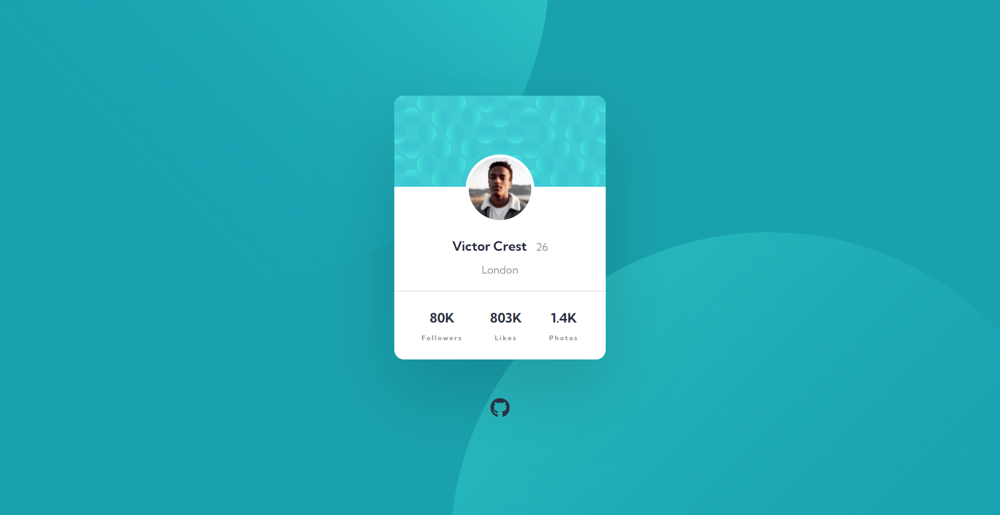

# Profile Card Component


## Links
- [Challenge Link](https://www.frontendmentor.io/challenges/profile-card-component-cfArpWshJ)
- [Site Preview](https://robinjmm-stat-preview-card.vercel.app/)

## About
This is my solution for the Profile Card Component challenge from [Frontendmentor.io](https://www.frontendmentor.io/challenges/profile-card-component-cfArpWshJ).

## User Stories
The user should be able to:
- View the optimal layout depending on their device's screen size

## Built With
- Semantic HTML5
- CSS3
- Flexbox
- Sass
- PostCSS

## Usage
You can download the project files by clicking on the green **Code** button,  then select **Download Zip**.

Once you finish extracting, move into the project folder, open the terminal, and run the following code while in the project directory:

```
npm install
```

This will install all the required dependencies.

To compile Sass into CSS and watch for any future changes, run the following code:

```
npm run sass
```

To continue watching changes in Sass files and automatically reload the browser, run the following code:

```
npm run dev
```
**Tip: You might have to manually reload the browser the first time you launch the dev server**

To compile Sass into a minified and production ready code, run the following code:

```
npm run prod
```

To locally preview the current production build, run the following code:

```
npm run preview
```

## Acknowledgement
I'm very grateful to the people at [Frontendmentor.io](https://www.frontendmentor.io) for providing designs and challenges that help me improve my skills as a web developer.
